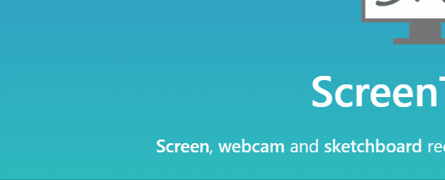

 
# **DatingDapp - Love on the block**

## Background

 Utlizing blockchain technology we have developed a dating dapp that will allow greater secuirty to its users by having a tiered structure of dating profiles and additinally provide each user the ability to send & receive encrypted messages. 

## Dependicies
- Python
- Remix
- Web3
- Solidity
- Piñata
- JSON
- IPFS
- OpenZeppelin

## Profile Interface
Working with Python, Web3, JSON and Piñata the user profile interface was created.

## DatingCoin
At illustrated in the GIF below, in this file we created our coin (DATE) using the ERC721Full standard. We developed tiered profiles that change based on the amount of information the user inputs.

## Profile Functions

## Profile Messages

## Profile Tokenization

